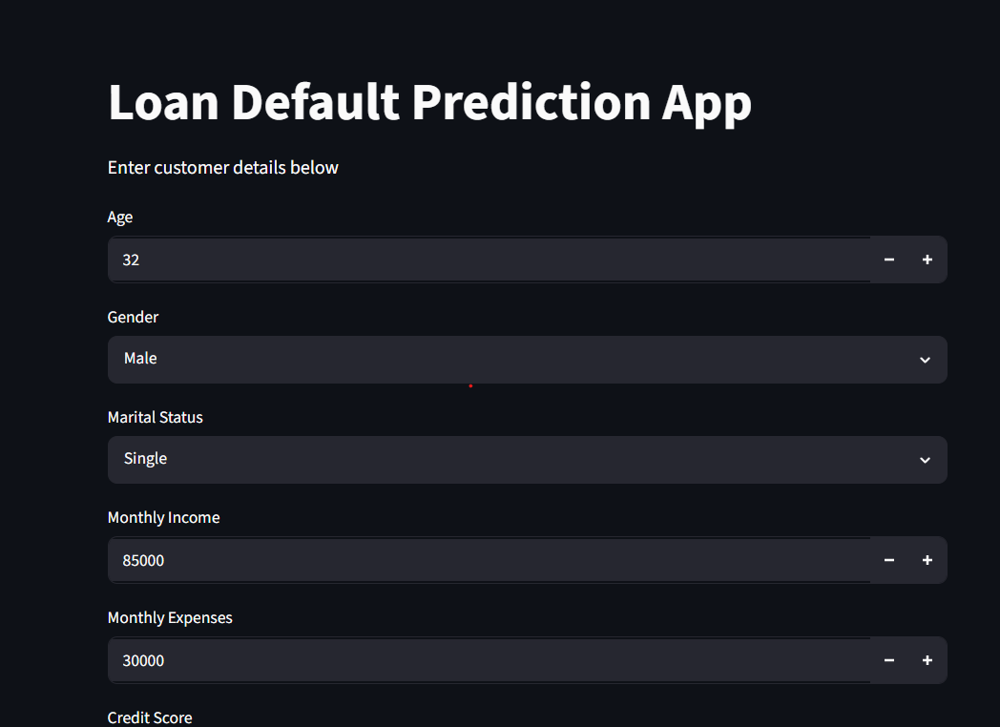
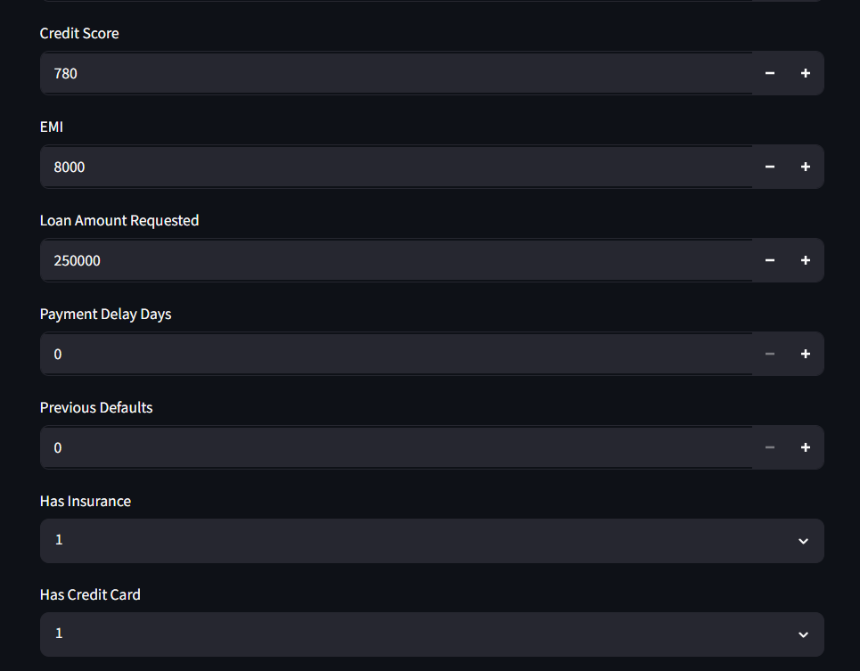
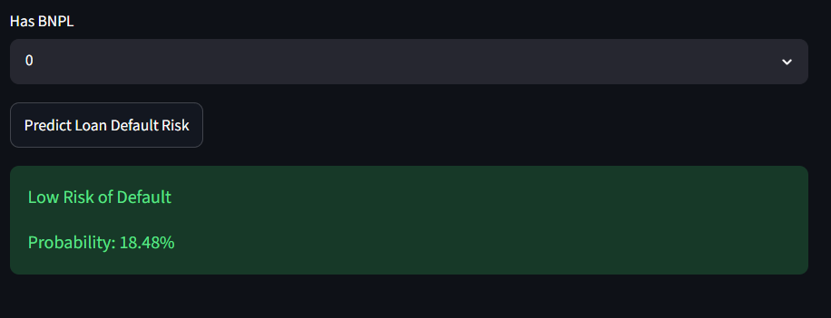
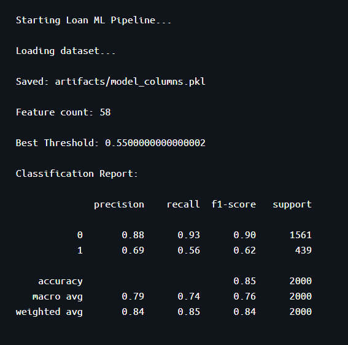
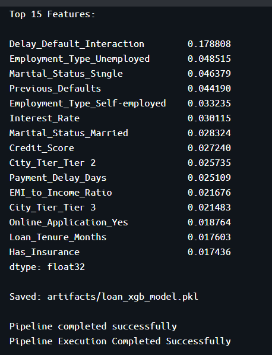

# 🏦 Loan Default Prediction System


A machine learning classification system that predicts whether a loan applicant is likely to default — helping financial institutions reduce risk and automate loan approval decisions.

🚀 **Live Demo:** [Launch Streamlit App](https://rajkiran-ds-loan-default-prediction-system-app-vchisg.streamlit.app/)

---

## Problem Statement

XYZ Financial Firm offers Business, Personal, and Educational loans. Their current approval process is entirely manual, making it slow and prone to missed defaulters. This system replaces that with an ML pipeline that flags high-risk applicants automatically using 10,000 historical loan records.

---

## Business Impact

| Goal | Approach |
|------|----------|
| Reduce financial risk | Predict defaulters before approval |
| Handle class imbalance | SMOTE oversampling (246 → 439 minority class) |
| Improve minority class detection | Macro F1-score optimization |
| Automate risk analysis | End-to-end prediction pipeline |
| Production-ready deployment | Streamlit + Docker |

---

## Tech Stack

| Category | Tools |
|----------|-------|
| Language | Python |
| Data Processing | Pandas, NumPy |
| ML Models | XGBoost, Gradient Boosting, Random Forest, and more |
| Imbalance Handling | SMOTE |
| App Framework | Streamlit |
| Containerization | Docker |
| Model Serialization | Pickle |
| Version Control | Git & GitHub |

---

## ML Pipeline

```
Data Loading → Target Encoding → Drop ID Columns → Missing Value Handling
→ Feature Engineering → Encoding → Train-Test Split → SMOTE Oversampling
→ XGBoost Training → Threshold Tuning → Final Predictions
→ Streamlit Deployment → Docker Containerization
```

---

## Feature Engineering

Six custom features were engineered to improve prediction performance:

| Feature | Description |
|---------|-------------|
| EMI Burden | Monthly EMI as a fraction of income |
| Net Savings | Monthly income minus monthly expenses |
| Loan-to-Income Ratio | Loan amount relative to monthly income |
| Delay-Default Interaction | Combined signal of payment delays and past defaults |
| Poor Credit Indicator | Binary flag for credit score below 600 |
| Total Products Held | Count of all financial products held by applicant |

---

## Model Experimentation

Seven classification algorithms were evaluated across four experiments before selecting the final model:

| Model | Notes |
|-------|-------|
| KNN | Distance-based approach |
| Naive Bayes | Probabilistic baseline |
| Decision Tree | Non-linear splits |
| Random Forest | Ensemble — strong baseline |
| AdaBoost | Boosting ensemble |
| **Gradient Boosting** | Best F1 in experimentation |
| **XGBoost** | ✅ Final model — solved class imbalance |

**Why XGBoost over Gradient Boosting?**

Gradient Boosting had the best F1 score during experimentation but produced **all zeros for Class 1** (defaulters) in the classification report due to severe class imbalance (support: 246). XGBoost with SMOTE oversampling raised minority class support to **439** and with threshold tuning produced reliable predictions for both classes.

**Experiments run:**

| Experiment | Strategy |
|------------|----------|
| Base Data | Raw data, no treatment |
| Winsorized Data | IQR-based outlier capping |
| Log Transformed Data | Log1p on positive numeric columns |
| Feature Selection + SMOTE | RF importance-based selection + SMOTE balancing |

---

## Model Highlights

- **XGBoost Classifier** used for final prediction
- **SMOTE** raised minority class from 246 → 439 samples
- **Threshold tuning** across 0.05–0.95 range for best Macro F1
- **scale_pos_weight** used to further handle class imbalance
- **Macro F1-score** used as primary evaluation metric
- Feature importance extracted and top 15 features printed

---

## Project Structure

```
Loan_Default_Prediction/
│
├── artifacts/              # Saved models and encoders
├── images/                 # Screenshots and visuals
├── logs/                   # Training and experimentation logs
├── src/
│   ├── __init__.py
│   ├── pipeline.py         # Final XGBoost training pipeline
│   └── experimentation.py  # Multi-model experimentation
│
├── app.py                  # Streamlit application
├── main.py                 # Pipeline entry point
├── Dockerfile
├── requirements.txt
├── setup.py
├── README.md
└── .gitignore
```

---

## Getting Started

### 1. Install Requirements

```bash
pip install -r requirements.txt
```

### 2. Run Training Pipeline

```bash
python main.py
```

This generates:
- Trained XGBoost model (`loan_xgb_model.pkl`)
- Encoded feature columns (`model_columns.pkl`)

### 3. Launch Streamlit App

```bash
streamlit run app.py
```

---

## Docker Support

### Build Image

```bash
docker build -t loan-default-app .
```

### Run Container

```bash
docker run loan-default-app
```

---

## Application Screenshots

### Streamlit Homepage



### Prediction Result


### Docker Deployment



---

## Future Improvements

- [ ] Hyperparameter tuning (GridSearchCV / Optuna)
- [ ] Model monitoring & drift detection
- [ ] CI/CD pipeline integration
- [ ] Cloud deployment (AWS/Azure)
- [ ] Explainable AI (SHAP values)

---

## Author

**Raj Kiran Reddy**
B.Tech Data Science | MLR Institute of Technology and Management
📍 Hyderabad, Telangana, India

[](https://github.com/)
[](https://linkedin.com/)